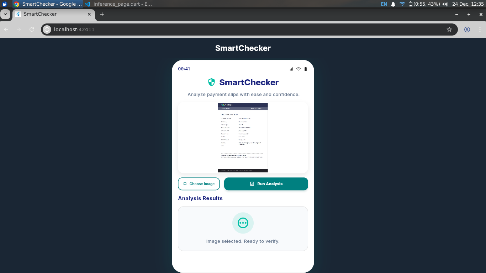
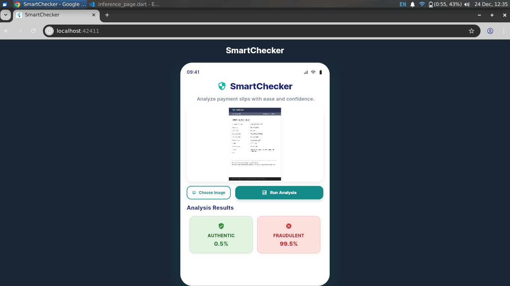

# SmartChecker - AI-Powered Image Authenticity Detector

## 📋 Overview
**SmartChecker** is a professional AI-driven application designed to detect the authenticity of documents and payment slips. Using the **EfficientNetV2-S** deep learning architecture, the system provides high-precision analysis to identify whether an image is authentic or has been manipulated/forged.

---

## 📱 Implementation Results
Below is the visual workflow of the application, from the initial upload state to the final AI analysis.

| 1. Ready to Upload | 2. Image Selected | 3. AI Result (Fraud Detection) |
| :---: | :---: | :---: |
|  |  |  |
| **Initial Dashboard** | **Document Preview** | **99.5% Fraudulent Detected** |

---

## ✨ Key Features
* 🚀 **High-Speed Inference:** Powered by EfficientNetV2-S for near-instant results.
* 📸 **Document Verification:** Specialized for validating payment slips and official records.
* 📊 **Probability Breakdown:** Real-time confidence scores for "Authentic" and "Fraudulent" classes.
* 🎨 **Responsive UI:** Modern, clean interface built with Flutter for a smooth user experience.
* 🛡️ **Robust API:** Scalable FastAPI backend with secure image processing.

---

## 🏗️ Technical Architecture
The project follows a modern Client-Server architecture:
1. **Frontend (Flutter):** Manages image selection (Gallery/Camera) and displays AI results.
2. **Backend (FastAPI):** Handles image normalization, resizing (384x384), and PyTorch model inference.
3. **ML Model:** EfficientNetV2-S trained for binary classification.

---

## 🚀 Quick Start Guide

### 1. Backend Setup

cd backend
pip install -r requirements.txt
# Ensure effv2s_fold5.pt is in this folder
uvicorn main:app --host 0.0.0.0 --port 8000
#### 2.Frontend Setup

cd frontend
flutter pub get
flutter run

.
├── backend/                # FastAPI Application & ML Model
├── frontend/               # Flutter Mobile Application
├── screenshots/            # Implementation result images
└── README.md
Built with ❤️ using Flutter, FastAPI, and PyTorch SmartChecker - Detect. Verify. Trust.
